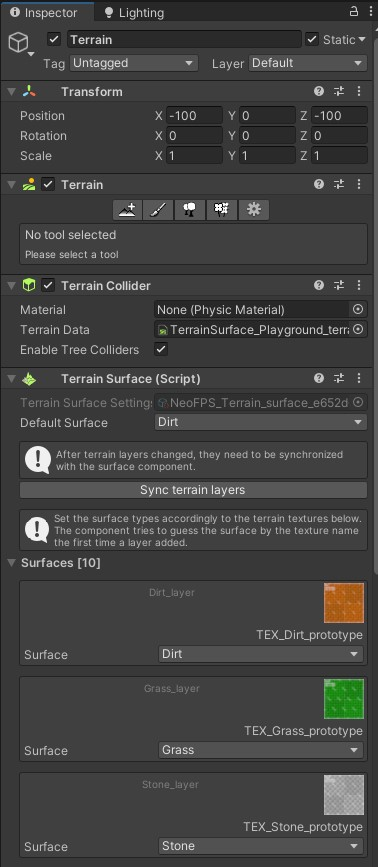

# NeoFPS Terrain Surface
#### An extension for NeoFPS allowing to detect surfaces on Unity Terrain (footsteps, shoot impacts, etc).
_Note that this is a 3rd-party extension asset from the team not affiliated with NeoFPS_.
_This package will be deprecated once NeoFPS introduce surfaces for terrains._

## Requirements
- Unity 2020.1 (not tested with lower versions)
- The [NeoFPS asset](https://assetstore.unity.com/packages/templates/systems/neofps-150179?aid=1011l58Ft) 1.1.07

## Overview

>The `TerrainSurface_Playground` demo scene can be found under `Assets\BlackSmallRiver\Integration\NeoFPS\Samples\Scenes\Playground\` 
folder

1. Add `TerrainSurface` component to the Terrain
2. Click `Create surface settings`
3. Choose a path within the Assets directory where to store the settings asset file
4. Terrain Surface will sync current Terrain Layers

If Terrain contains no Terrain Layers (they are textures painted on the terrain) yet, add any and click on `Sync terrain layers`

